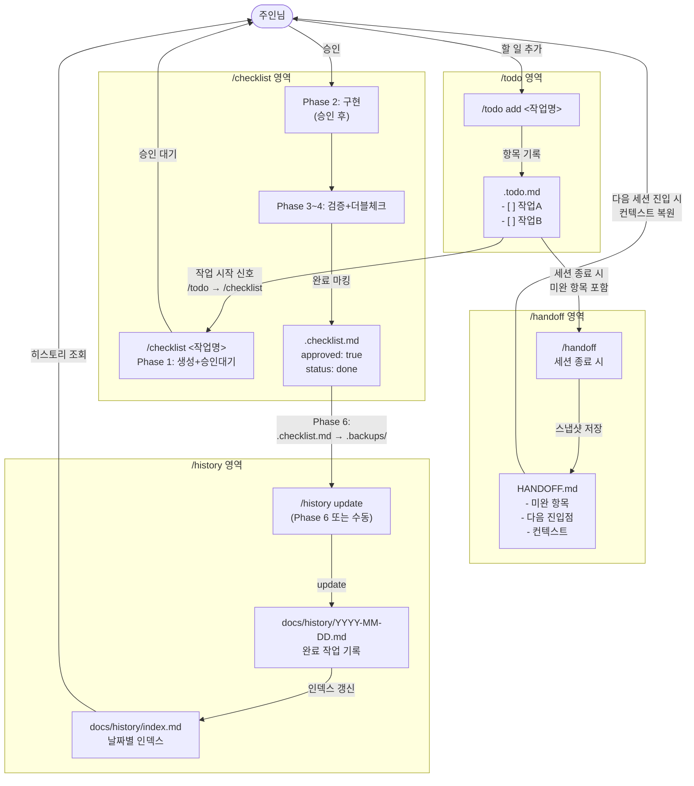

# 4개 스킬 데이터 흐름 다이어그램

> 작성자: workflow-ux (팀: skill-quartet-planning) | 2026-04-29
> skill-architect 01/02 사양서 미완성 시점에서 병렬 작성. 기존 SKILL.md 직접 인용 기반.

---

## 1. 스킬별 책임 경계 요약

| 스킬 | 핵심 파일 | 책임 | 타 스킬과의 접점 |
|------|-----------|------|----------------|
| `/todo` | `.todo.md` | 할 일 목록 등록·추적·완료 처리 | `/checklist` 시작 신호 / `/handoff` 미완료 이관 |
| `/checklist` | `.checklist.md` | 단일 작업의 승인→구현→검증 흐름 관리 | `/todo`에서 트리거 / 완료 후 `/history` 기록 |
| `/handoff` | `HANDOFF.md` | 세션 종료 시 컨텍스트 스냅샷 저장 + 다음 세션 복원 | `/todo` 미완 항목 포함 / `/history` 보완 |
| `/history` | `docs/history/YYYY-MM-DD.md` + `index.md` | 완료 작업의 영구 기록 (왜 했는가 포함) | `/checklist` Phase 6에서 갱신 / `/handoff` 참조 |

**책임 중복 검증**: 미완료 항목은 `/todo`(당일 추적) + `/handoff`(세션 인계)에 둘 다 존재하나, 역할이 다름 — `.todo.md`는 작업 관리 원부, `HANDOFF.md`는 다음 세션 진입점. 갱신 트리거도 다름(수시 vs 세션 종료). 중복이 아닌 **뷰 분리** 구조.

---

## 2. 파일 노드 목록

```
파일 노드:
  F1: .todo.md          (/todo 관할)
  F2: .checklist.md     (/checklist 관할)
  F3: HANDOFF.md        (/handoff 관할)
  F4: docs/history/YYYY-MM-DD.md  (/history 관할)
  F5: docs/history/index.md       (/history 관할)
```

---

## 3. 메인 흐름 다이어그램 (Mermaid)



---

## 4. ASCII 보조 다이어그램 (단계별 흐름)

```
세션 시작
    │
    ▼
[/handoff 읽기] ─── HANDOFF.md 존재 시 → 미완 항목 + 컨텍스트 복원
    │
    ▼
[/todo] ──────────── .todo.md에 신규 항목 추가 (또는 기존 항목 확인)
    │
    │ 작업 시작 신호
    ▼
[/checklist] ─────── .checklist.md 생성 → 주인님 승인 대기 (Phase 1 종료)
    │
    │ 주인님 승인
    ▼
[구현 진행] ─────────── .checklist.md [x] 항목별 체크
    │
    ▼
[검증 + 더블체크] ───── Read 증거 / lint / 교차검증 (Phase 3~4)
    │
    ▼
[/todo 완료 처리] ────── .todo.md 해당 항목 [x] 마킹
    │
    ▼
[/history update] ────── docs/history/YYYY-MM-DD.md + index.md 갱신
    │
    ▼
세션 종료 직전
    │
    ▼
[/handoff] ──────────── HANDOFF.md 에 미완 항목 + 다음 진입점 저장
    │
    ▼
세션 종료
```

---

## 5. 엣지 케이스: 세션 중단 시 데이터 흐름

```
세션 중간 단절 (예: Claude Code 재시작, 네트워크 끊김)
    │
    ├─ /checklist 작업 중이었다면
    │      .checklist.md 에 체크된 항목까지 상태 보존 (파일 기반)
    │      → 다음 세션에서 .checklist.md Read 후 이어서 진행 가능
    │
    ├─ /todo 항목 중간이었다면
    │      .todo.md 의 마지막 저장 상태로 복원
    │      → 미완 항목 그대로 남아있음
    │
    └─ /handoff 가 미실행이었다면
           HANDOFF.md 에 컨텍스트 없음
           → /todo 의 미완 항목 + .checklist.md 상태로 최소 복원 가능
           → 단, "왜 이 작업을 하고 있었는지" 컨텍스트는 손실
```

**gap 확인**: `/handoff` 미실행 시 컨텍스트 손실이 발생함. 이를 막으려면 세션 종료 훅(`PostToolUse` 또는 `stop` 이벤트)과의 연동이 필요하나, 현재 설계는 수동 호출 기반.

---

## 6. 파일 갱신 트리거 매트릭스

| 파일 | 갱신 스킬 | 갱신 타이밍 | 방향 |
|------|----------|------------|------|
| `.todo.md` | `/todo` | 항목 추가·완료·삭제 시 | 수시 (작업 단위) |
| `.checklist.md` | `/checklist` | Phase 1 생성 / Phase 2 [x] 체크 / Phase 6 이동 | 작업 단위 |
| `HANDOFF.md` | `/handoff` | 세션 종료 직전 | 세션 단위 |
| `docs/history/YYYY-MM-DD.md` | `/history` | 작업 완료 후 (Phase 6 또는 수동) | 완료 시 1회 |
| `docs/history/index.md` | `/history` | 일별 파일 갱신 시 함께 | 완료 시 1회 |

---

## 5게이트 검증

### (1) 라인 실측

- checklist SKILL.md (C:/Users/rlgns/OneDrive/문서/Harness-engineering/skills/checklist/SKILL.md): 174줄 실측
  - Phase 6 정의: 65~67줄 — "`.backups/` 디렉토리로 이동", "docs/history/{YYYY-MM-DD}.md 업데이트 + docs/history/index.md 갱신"
  - tiny edit 예외 조건: 151~153줄 — "한 파일의 단일 Edit, 3줄 이하 + 240자 이하"
- project-history SKILL.md: 114줄 실측
  - 업데이트 절차: 68~75줄 — "오늘 날짜 파일 생성 or 수정", "index.md에 한 줄 추가"

### (2) 반박/유보

**약한 부분**: 파일 갱신 트리거 매트릭스(섹션 6)에서 `.todo.md` → `/checklist` 연동을 "작업 시작 신호"로 표현했으나, 현재 `/todo` 스킬이 실제로 `/checklist`를 자동 트리거하는지 명세가 불확실함. skill-architect 사양서(01_todo_spec.md) 미완성으로 추정으로 기재했으며, critic 단계에서 정합성 검증 필요.

### (3) 근거 강도

- `/checklist` Phase 6 → `/history` 갱신 연동: **강** (SKILL.md 65~68줄 직접 인용)
- `/todo` → `/checklist` 트리거 연동: **약** (01_todo_spec.md 미완성 — 추정)
- 세션 종료 직전 `/handoff` 호출: **중** (index.md 진행 중 섹션 패턴 기반)

### (4) 자기 비판

이번 다이어그램에서 놓쳤을 가능성: `/todo`와 `/checklist` 간 자동 트리거 여부를 단정 짓지 못해 흐름 엣지가 점선(추정) 수준으로 남음. 01_todo_spec.md 완성 후 해당 엣지를 실측으로 교체해야 완전한 다이어그램이 됨.
